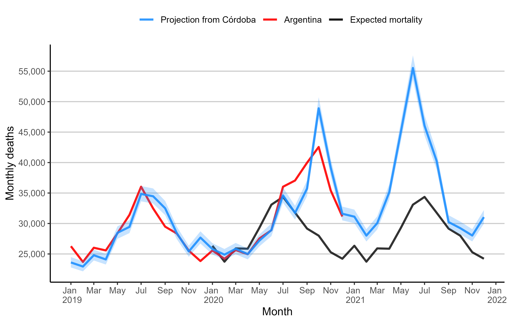

# National Excess Mortality from Sub-National data: Method and Application for Argentina

This repository contains script and data for the paper `National Excess Mortality from Sub-National data: Method and Application for Argentina`.

